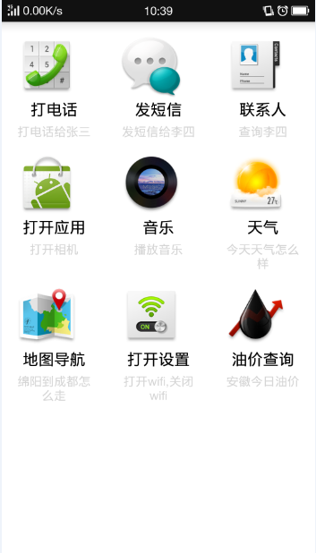
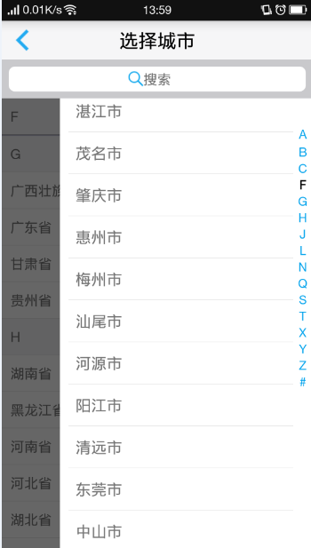
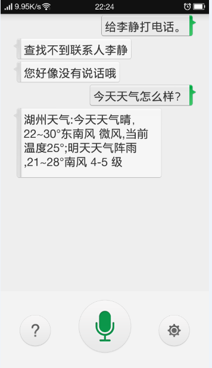
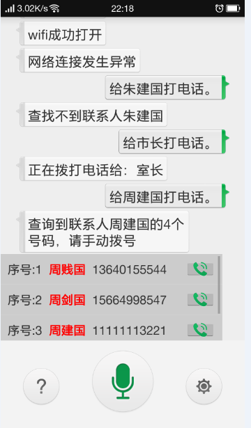
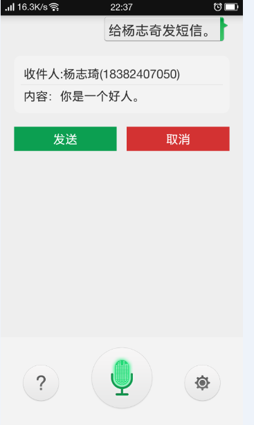
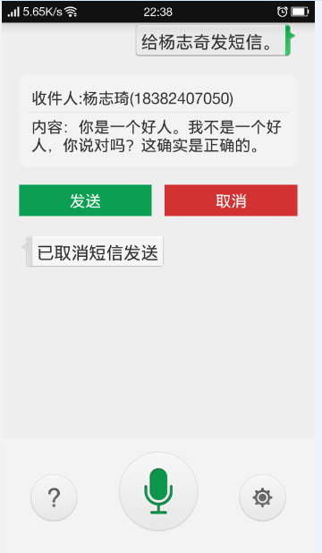
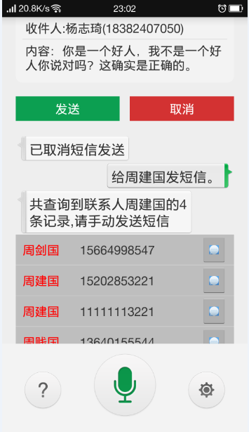
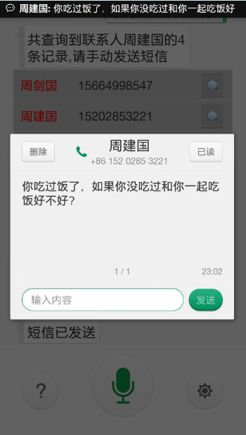

# VoiceAnimationInteraction
通过语音指令控制手机，来进行一系列指令的操作。包括语音打开应用、播放音乐、查询天气、发送短信等。语音api采用的是科大讯飞的语音相关技术，主要提取了其语音合成和语音听写技术。

## 界面

一共界面有4个，分别是语音指令提示界面、设置界面、城市选择界面（天气、油价查询需要用到所属城市）以及语音指令主界面。

### 操作提示界面

可以提供的操作如上图所示，可以使用的指令一共有8个，**其中地图导航没有实现**。

### 设置界面

设置界面，主要是用来做些配置信息，比如语音的前后端点超时、朗读语速等。

### 城市选择界面

城市选择，具体级别到市的层级。支持模糊查询。

### 主界面

主界面比较简单，主要是三个按钮和一个大的滑动窗口。

## 主要功能界面截图

### 语音拨号

  

### 语音发送短信

发送短信功能是所有指令中实现难度最大的一个，发送短信支持人员姓名模糊匹配查找，一条短信支持多次语音输入。

 